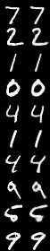

# Convolutional Autoencoder for MNIST

This repository contains a simple implementation of a convolutional autoencoder for the MNIST dataset using TensorFlow and Keras.

## Overview

The `ConvAutoencoder` class implements a convolutional autoencoder with an encoder and decoder architecture. The model is trained on the MNIST dataset to reconstruct input images.

## Autoencoders

Autoencoders are a type of artificial neural network used for unsupervised learning. They are primarily designed for data compression, feature learning, and generation. The architecture of an autoencoder consists of an encoder and a decoder, and the network is trained to reconstruct its input data.

### Components of an Autoencoder

1. **Encoder:** The encoder takes the input data and transforms it into a compressed representation, often referred to as the "latent space" or "encoding." This encoding should ideally capture the most important features of the input data.

2. **Decoder:** The decoder takes the compressed representation generated by the encoder and attempts to reconstruct the original input data from it. The goal is to minimize the difference between the input and the reconstructed output.

### Key Concepts

#### 1. **Latent Space Representation:**
   - The latent space is a lower-dimensional representation of the input data. It captures essential features, enabling the network to reconstruct meaningful outputs.

#### 2. **Loss Function:**
   - Autoencoders are trained by minimizing a loss function that measures the difference between the input and the reconstructed output. Mean Squared Error (MSE) is a common choice for this purpose.

#### 3. **Undercomplete Autoencoder:**
   - An undercomplete autoencoder constrains the size of the latent space to be smaller than the input space. This encourages the model to learn a more efficient representation.

#### 4. **Applications:**
   - **Data Compression:** Autoencoders can be used to compress data into a more compact representation.
   - **Feature Learning:** By training on unlabeled data, autoencoders can learn useful features that can later be used for supervised tasks.
   - **Image Denoising:** Autoencoders can be trained to remove noise from images.
   - **Anomaly Detection:** An autoencoder trained on normal data may struggle to reconstruct anomalous data, making it useful for detecting outliers.

## Model Summary

The trained autoencoder model has the following architecture:

```plaintext
Model: "autoencoder"
_________________________________________________________________
 Layer (type)                Output Shape              Param #   
=================================================================
 input_1 (InputLayer)        [(None, 28, 28, 1)]       0         
                                                                 
 encoder (Functional)        (None, 16)                69392     
                                                                 
 decoder (Functional)        (None, 28, 28, 1)         109377    
                                                                 
=================================================================
Total params: 178769 (698.32 KB)
Trainable params: 178385 (696.82 KB)
Non-trainable params: 384 (1.50 KB)
_________________________________________________________________
```


## Requirements

- Python 3.x
- TensorFlow 2.x
- NumPy
- Matplotlib
- OpenCV

## Usage

1. Clone the repository:

   ```bash
   git clone https://github.com/seyyedmsl82/Autoencoder.git
   cd Autoencoder
   ```

2. Install the required dependencies:

   ```bash
   pip install -r requirements.txt
   ```

3. Run the script:

   ```bash
   python Autoencoder.ipynb
   ```

   This will train the convolutional autoencoder on the MNIST dataset and save the reconstructed images to `output_image.png`.


## Result

The reconstructed images are saved to `output_image.png`. Each row in the image represents an original image (left) and its reconstructed counterpart (right).




- The code includes an `if __name__ == "__main__":` block for script execution.
- The `Autoencoder.ipynb` script uses the MNIST dataset and assumes an internet connection for dataset download.

Feel free to explore and modify the code for your own experiments!
